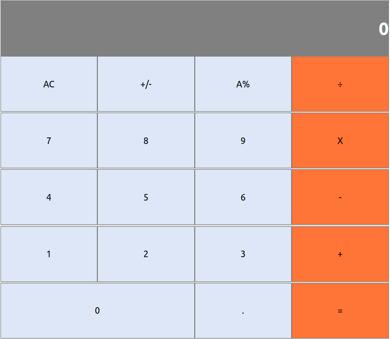

## ReactJS Calculator

This a calculator app built with ReactJS. Using CSS, and props.

In the project directory, you can run:

## yarn start

Runs the app in the development mode. 
Open [http://localhost:3000](http://localhost:3000) to view it in the browser.

The page will reload if you make edits. 
You will also see any lint errors in the console.

## Built With

- ReactJS
- CSS
- Visual Code

## Live Demo

[Live Demo Link](https://gonreactapp.herokuapp.com/)

### Prerequisites
npm 6.13.14

## Author:
👤 **Gonza Javier Mancilla**

- Github: [@gonjavi](https://github.com/gonjavi)
- Linkedin: [@g-javier-mancilla](https://www.linkedin.com/in/g-mancillla)

## Future Updates/Improvements
Add the following characteristics:

## 🤝 Contributing

Contributions, issues and feature requests are welcome!

## Show your support

Give a ⭐️ if you like this project!

## 📝 License

This project is [MIT](lic.url) licensed.

